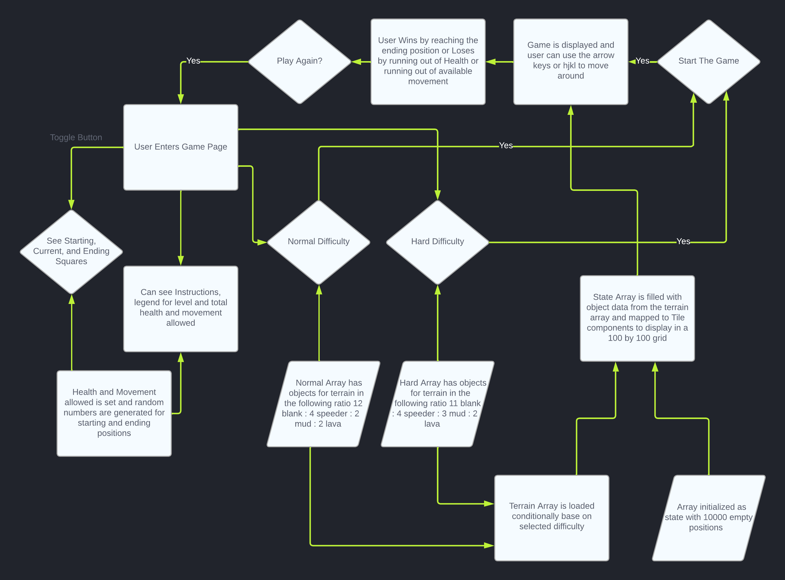

# Grid Game

### Live Demo Hosted on Vercel

[Click Here](https://grid-game-ten.vercel.app/) to visit the site

### To Use This Repository Locally

Enter your terminal and do the following:
- Clone the repository: `git clone https://github.com/JoshM-Yoru/GridGame.git`
- Enter the repository: `cd GridGame`
- Install dependencies: `npm i`
- Start up server: `npm run dev`

### Things Left To Do

- Increase performance by decreasing re-renders if possible
- Style Game Better

#### Parameters

- 100 x 100 grid
- Start and End Points
- Player has 100hp and 150 movement
- 4 types of terrain
    - Road/End
        - -0 hp
        - -1 movement
    - Speeder
        - -5 hp
        - -0 movement
    - Mud
        - -10 hp
        - -5 movement
    - Lava
        - -50 hp
        - -10 movement
    - Start
        - 0hp
        - 0 movement

#### App Logic

- Create a component for the tiles
- Populate a 100 x 100 matrix with components
- Set the start and ending points
- Inject data into components using rng from JSON
- User will press start to insert character into the starting position
- User will use arrows keys to move
    - Active tiles will be marked true when the user is on them while all others will be false
- JSON data for each object/tile will affect the user hp and movement, this will be done with state variables 

